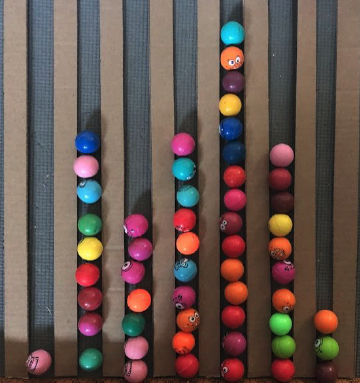
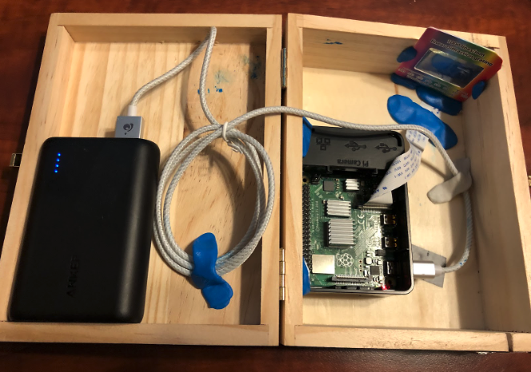
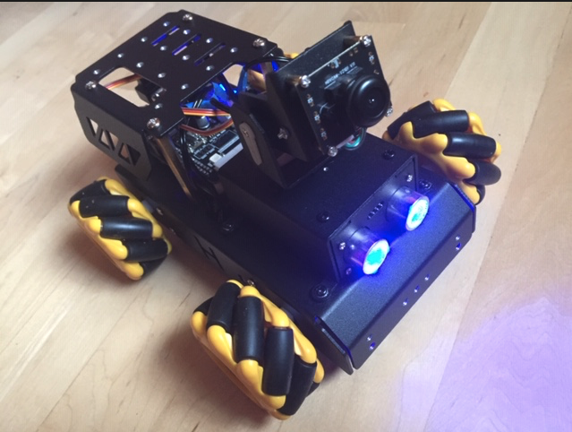

## ***Bush Fundamentals of Computing*** (FCSR) class Spring 2024 
#### taught by *Chandru Narayan*

### Welcome to the ***Fun(damentals) of Computing course!***

Galton Board|Python-JupyterLab
:---:|:---:
|

Spectroscope|SnooPI
:---:|:---:
|

LED Pixel Board|Light Sensor
:---:|:---:
|

This class is designed to teach the fundamentals and nature of modern computing, experimental science (learn by doing), language of data, and design thinking. Students will learn current research, programming, edge computing, data analysis, and visualization skills that any researcher might need during the course of a project while in college or your first career.

We will be using state-of-the-art tools a typical scientist, artist or a humanities student might use to build a portfolio of accomplishments, publish your work to the internet, allowing others to find about you and your interests. Technologies include and not limited to Github and Markdown syntax, Google Sheets, Python, Jupyter Notebooks, Jupyterlab/Colab, Matplotlib and Physical computing using Raspberry PI. We will build basic to sophisticated applications of these skills to multiple engaging 2-week tactile and visual projects in STEAM (science, technology, engineering, art, and maths) subjects. The courseware is typically tactile (hands-on, experimental) and visual (graphical, mechanical) with focus on the mind-body connection of learning.

Skills we will teach include:
1. *Jupyter Notebooks & Markdown* language - it is the author/publish tool for Google colab. It is used to create and state-of-the art digital notebooks with text, media and runnable code published on the web.  It is the authoring tool of choice for millions of students and researchers in universities and corporations worlwide.
1. JupyterHub & JupyterLab (dev environment for Jupyter Notebooks adopted widely by universities)
1. Markdown Syntax (dynamic text, images, video and code embedded publishing)
1. LaTeX (web and github enables equation editor for research)
1. Python (language of choice for data science and STEAM publications)
1. Matplotlib (modern chrting plotting large volumes of data)
1. Physical Computing and Modeling projects using Raspberry PI

Most materials for this course was created, maintained and published using the same tools listed above.

The class will conclude with a final project and seminar offered to fellow students, parents and faculty detailing the results of your projects and learning at the UW.  The course is designed in collaboration with UW, Boyce-Astro and the Mt Wilson institute.

This website will be updated frequently and used daily for the FCSR course. So please bookmark it check it frequently. 

## What is Jupyter?

If you are not familiar with [Project Jupyter](http://jupyter.org/), [Jupyter Notebook](https://jupyter.org/try-jupyter/retro/notebooks/?path=notebooks/Intro.ipynb) [JupyterLab](https://jupyter.org/try-jupyter/retro/notebooks/?path=notebooks/Intro.ipynb) or [JupyterHub](http://jupyter.org/hub), I highly recommend learning about them by following the embedded links.  

All of the content provided here are accessible to you using a combination of technologies provided by [Jupyter](http://jupyter.org/) and [Github](https://github.com/) where 83+ million researchers around the world come together to publish the share their work.  

You will be accessing your own 'virtual laptop' hosted on a Google virtual machine somewhere in the globe to do your work.  You class materials will be available to you there and you will store the products of your learning there and not on your physical computer from which you are accessing this course. Your work will be to modify the Jupyter Notebooks to add text, images, video, to write your own code, query and retrieve astronomical databases, analyze and plot your results graphically.

You will be logging into JupyterHub for getting workshop materials and creating your own Jupyter Notebooks.  Your username is simply the word ```fcsr``` followed by ```<your first name>``` you provided in your registration. For instance, my username would be ```fcsrchandru```. The first time you will log in, create a password you make up yourself.  That will become your actual password for this JupyterHub - please try not to forget it.  If you do, please email me at chandru.narayan@bush.edu, I will reset it.

## ***[Login to Bush JupyterHub here to validate](https://bushastrolab.com/hub/login)***

## Workshop organization & JupyterHub - your own virtual laptop in the sky!

The structure of this Workshop includes specific ***Projects*** below.  These Projects provide access to multiple materials, inside JupyterLab **your own virtual laptop**, Jupyter Notebooks, media files (images, video), presentations, PDF files, CSV files, database files and the like.  Each Project wil have its own collection of content linked below.  

When you do so, it will make your own initial copy to your JupyterHub account and allow you to edit and modify them.  As you modify them, ***JupyterLab*** (the IDE inside JupyterHub) will keep track of the modifications and you ***should never lose your edits***.  It is highly recommended that you ***do not change the names of the notebooks or files*** as they are being tracked and version controlled. You can always return to this page to access any specific project below where you can access your latest edits.  JupyterHub is widely used and state-of-the-art mechanism that universities use to manage Jupyter Notebooks and other course materials. 

All Project submissions will be made to JupyterHub as Jupyter Notebooks or other media such as Google Sheets, Video etc. Feedback on your submissions will be given on the Jupyter Notebook itself. 

All assignments for Projects and classwork etc. will be made on the Bush Portal and will be due on the date specified there. Grades for each project will also be assigned on the Bush Portal.

Please click on the "zeroth" project link below to get started on your assigned project!

## Projects repository for the Fundamentals of Computing classroom

id|Project Type|Status|Topic Description
:---|:---|:---|:---
0|Classwork|🟢 COMPLETE|<a href="https://chandrunarayan.github.io/fcsr/projects/intro_to_fcsr" target="_blank">FCSR Course Introduction</a>
1|Classwork|🟢 COMPLETE|<a href="https://chandrunarayan.github.io/fcsr/projects/intro_to_jupyter" target="_blank">Introduction to JupyterLab and Markdown</a>
2|Project|🟡 STARTED|<a href="https://chandrunarayan.github.io/fcsr/projects/intro_to_python" target="_blank">Introduction to Python & Plotting</a>
3|Project|🔵 NOT STARTED|<a href="https://chandrunarayan.github.io/fcsr/projects/intro_to_rpi" target="_blank">Intro to Raspberry PI (rPI)</a>
4|Project|🔵 NOT STARTED|<a href="https://chandrunarayan.github.io/fcsr/projects/dart_board_pi" target="_blank">Dart Board PI</a>
5|Classwork|🔵 NOT STARTED|<a href="https://chandrunarayan.github.io/fcsr/projects/rpi_led_string" target="_blank">Build LED Matrix and Program Patterns in Python</a>
6|Project|🔵 NOT STARTED|<a href="https://chandrunarayan.github.io/fcsr/projects/dart_board_pi" target="_blank">Integrate Dart Board PI with your Pixel Board to compute PI</a>
7|Project|🔵 NOT STARTED|<a href="https://chandrunarayan.github.io/fcsr/projects/selfie_booth" target="_blank">Build a Selfie Booth with a rPI Camera & Python</a>
8|Classwork|🔵 NOT STARTED|<a href="https://chandrunarayan.github.io/fcsr/projects/python_deep_dive" target="_blank">A deeper dive into Python Programming</a>
9| Project|🎉 🔵 NOT STARTED FINAL Project 1.|<a href="https://chandrunarayan.github.io/fcsr/projects/rpi_car" target="_blank">Build an autonomous self-driving smart car to Avoid Obstacles</a>
10| Portfolio|🎉 🔵 NOT STARTED FINAL Project 2. Seniors doing Senior Projects are Exempt|<a href="https://chandrunarayan.github.io/fcsr/projects/rpi_spectroscope" target="_blank">Build a rPI spectroscope to capture and measure emission spectra of elements</a>

## Raspberry PI Project Teams

Team|Team Type|Members|Web Host|JupyterLab Host
:---|:---|:---|:---|:---
1| Project|🟤 NOT FORMED|[bupi1](http://bupi1)|[http://bupi1:8081](http://bupi1:8081)
2| Project|🟤 NOT FORMED|[bupi3](http://bupi3)|[http://bupi3:8081](http://bupi3:8081)
3| Project|🟤 NOT FORMED|[bupi4](http://bupi4)|[http://bupi4:8081](http://bupi4:8081)
4| Project|🟤 NOT FORMED|[bupi7](http://bupi7)|[http://bupi7:8081](http://bupi7:8081)

## Autonomous Car Project Teams

Team|Team Type|Members|JupyterLab Host
:---|:---|:---|:---
1| Final Project|🟤 NOT FORMED|[http://bupi2:8181](http://bupi2:8181)
2| Final Project|🟤 NOT FORMED|[http://bupi5:8181](http://bupi5:8181)
3| Senior Project|🟤 NOT FORMED|[http://tupi1:8181](http://tupi1:8181)

## Spectroscope Project Teams

Team|Team Type|Members|JupyterLab Host
:---|:---|:---|:---
1| Final Project|🟤 NOT FORMED|[http://bupi1:8081](http://bupi1:8081)
2| Final Project|🟤 NOT FORMED|[http://bupi7:8081](http://bupi7:8081)
