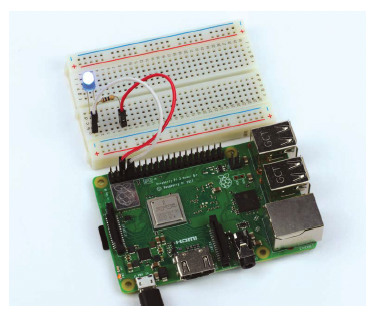

# Introduction to Raspberry PI (rPI) & LED Circuits

### [Reference document for First Steps in Learning about Raspberry PI](Bush_RPI_PYTHON_ROBOTICS.pdf)

### Step 1. Geto to know and then Access Your Assigned Team Raspberry PI

1. Let's examine your rPI host and get to know it. It has to be handled delicately at all times!. We will now power it up and wait for 2 minutes. We can then make sure it shows up on the Bush network!


1. [Click here to Verify access to Your Team Raspberry PI  (replace bupiX with your assigned  rPI hostname in the address bar of your browser)](http://bupiX.bush.edu)
Do you see Confetti ?? 

1. [Click here to Access Your Team Raspberry PI's JupyterLab (replace bupiX with your rPI hostname in the address bar of your browser)](http://bupiX.bush.edu:8081)
1. Run the sysinfo.ipynb from the /data folder to see output from your PI. If you do not see sysinfo.ipynb you can [download it here](sysinfo.ipynb) and then drag the file to your PI

1. We will use the Multimeter to measure some voltages from the pins.

1. Wire-up your RPI following instructions in the First Steps PDF above



1. Create a new Jupyter Notebook. Name it ```first_notebook.ipynb```. Copy the following lines of code inside a code cell in your notebook. Then Shift-Enter to run it. Do you see your LED blinking?


````
# first led circuit
import gpiozero
import time

led = gpiozero.LED(4)

while True:
    led.on()
    time.sleep(1)
    led.off()
    time.sleep(1)
````

### Step 2. LED circuit
1. Change sleep time to see if it works
2. ChangeGPIO port to 18, re-wire the RPI and see if it works again

### Step 3. Button control
1. Wire-up your RPI following instructions in the First Steps PDF above. Install the button further down the breadboard so as not to intrfere with the led previously installed


1. Create another Jupyter Notebook.  Name it ```button_test.ipynb```. Copy the following lines of code inside a code cell in your notebook.

````
# button pressed
import RPi.GPIO as GPIO
import time
from datetime import datetime

GPIO.setmode(GPIO.BCM)

GPIO.setup(21, GPIO.IN, pull_up_down=GPIO.PUD_UP)

while True:
    input_state = GPIO.input(21)
    current_time = datetime.now().strftime("%H:%M:%S")
    if input_state == False:
        print(f'Button Pressed @ {current_time}')
        time.sleep(0.2)

````

### Step 4. Control LED via Button
1. Create a 3rd Jupyter Notebook to accomplish this Step. Name it ```button_led.ipynb```

1. Now we will attempt to combine the Button capability to turn on or turn off the LED. This means that the button needs to behave like a toggle switch. 

    * Press it once - LED should turn On.
    * Press it again - LED turns off.  
    

1.  Your challenge is to modify the code in Step 3 and add bits and pices of the code in Step 2 to make this happen.  There should be no wiring changes necessary.  Consult with your team member to see if you can accomplish this.  I will be there to help!

1. Modify code once again to accomplish the following - 

    * Press it once - LED should Blink.
    * Press it again - LED turns off and doesn't blink.  

### Step 4. Control the number of Blinks of the LED via Button

1. Create a 4th Jupyter Notebook to accomplish this.  Name it ```loop_blink.ipynb```

1. Modify code from previous step once again to accomplish the following - 

    * Press button - LED should Blink once with a 1 second gap, then twice with a 1 second gap, then 3 times with a 1 second gap, then 4 and 5 times in a similar fashion.
    * Subsequent button presses should be ignored when the last sequence is happening. 
    * When sequence finishes, again look for button presses and start sequence all over again!