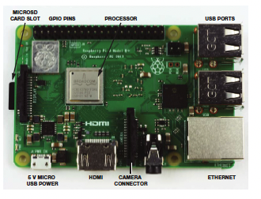
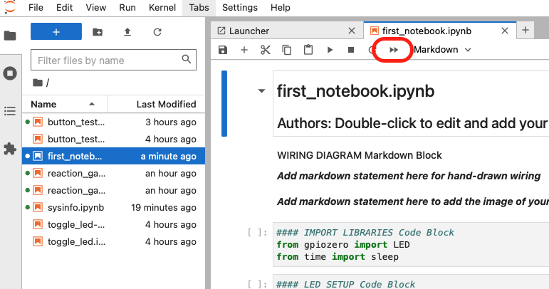
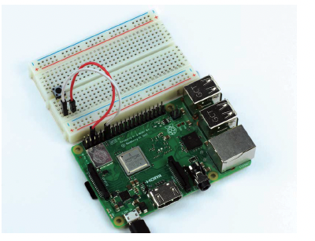

# Introduction to Raspberry PI (rPI) & LED Circuits

### [Reference document for First Steps in Learning about Raspberry PI](Bush_RPI_PYTHON_ROBOTICS.pdf)

### Step 1. Geto to know and then Access Your Assigned Team Raspberry PI

1. Let's examine your rPI host and get to know it. It has to be handled delicately at all times!. We will now power it up and wait for 2 minutes. We can then make sure it shows up on the Bush network!

    

1. [Click here to Verify access to Your Team Raspberry PI  (replace bupiX with your assigned  rPI hostname in the address bar of your browser)](http://bupiX.bush.edu)

    Do you see Confetti ?? 

1. [Click here to Access Your Team Raspberry PI's JupyterLab (replace bupiX with your rPI hostname in the address bar of your browser)](http://bupiX.bush.edu:8081)
 
    | :exclamation: :white_check_mark:  Do you see the JupyterLab coming from your Raspberry PI ??   |
    |-----------------------------------------|
    

1. Download the ```sysinfo.ipynb``` by [right-clicking this link and select 'Save Link As'](sysinfo.ipynb) and then drag the file to your PI's JupyterLab. Run the sysinfo Jupyter Notebook and document your results in a ```dated``` page of your workshop notebook.

    | :exclamation: :white_check_mark:  Did you write down the your RPI's sysinfo results in a ```dated``` page of your Workshop Notebook ??   |
    |-----------------------------------------|


1. We will use the Multimeter to measure some voltages from the pins. See the pin layout of your Raspberry PI Host below. Place the ```Black probe``` of your Multimeter on any ```GND ground``` pin of your rPI and the ```Red probe``` on the ```3V3 or 5V pin``` of your rPI. Write down the voltage youmeasure from the 3.3 volt pin and the 5 volt pin on your Raspberry PI on the previosly ```dated``` page of your Workshop Notebook. 


    
    

    | :exclamation: :white_check_mark:  Did you write voltages down on the ```dated``` page of your Workshop Notebook ??  |
    |-----------------------------------------|
    
### Step 2. Let's create our first Raspberry PI Jupyter Notebook in JupyterLab

1. Download the ```first_notebook.ipynb``` by [right-clicking this link and select 'Save Link As'](first_notebook.ipynb) and then drag the ```first_notebook.ipynb``` file to your laptop to the rPI's JupyterLab.  

1. Create a hand-drawn wiring diagram for the following circuit imaged below. Modify the template of the wiring diagram given to you to create this drawing. Take a picture of the wiring diagram and mail it to yourself. Add this picture file (.jpg or .png) from your laptop to your laptop to the rPI's JupyterLab.  Add a link to this picture inside the Wiring diagram Markdown cell created for you by adding a single line similar to:
    ````
    
    ````
1. Wire-up your RPI following your own hand-drawn diagram. Note LED +lead should be connected to GPIO4. The other (-ve) lead of the LED can be directly connected to the ground via the -ve rail of the breadboard.

    
    

1. Now you are ready to Run the Jupyter Notebook ```first_notebook.ipynb```. Your notebook should like the image below. Click the red-circled button to Run your notebook.

    


    | :exclamation: :white_check_mark:  Did you create, and upload your wiring diagram and verify the corresponding code in the Jupyter Notebook ??  If not, please do this as it is part of your assessment!  |
    |-----------------------------------------|
    
    | :exclamation: :white_check_mark:  Do you see your LED blinking? If not, please debug with your partner by looking at the wiring diagram, and code.  If this fails, call me or the TA to assist you  |
    |-----------------------------------------|

### Step 3. LED circuit
1. Change sleep time to see if it works
1. Change LED to GPIO port to 18. The other (-ve) lead of the LED can be directly connected to the ground via the -ve rail of the breadboard. Change the code correspondingly and and run to see if it works again!

    | :exclamation: :white_check_mark:  This is practice only - you do not need to draw a wiring disgram diagram for this. Does it work ?  If not, please debug with your partner or call me or the TA to assist you  |
    |-----------------------------------------|
    

### Step 4. Button control - Adding a Button to the circuit

1. Download the ```button_test.ipynb``` by [right-clicking this link and select 'Save Link As'](first_notebook.ipynb) and then drag tthe ```button_test.ipynb``` file to your laptop to the rPI's JupyterLab.  

1. Create a hand-drawn wiring diagram for the following circuit imaged below. Modify the template of the wiring diagram given to you to create this drawing. In this circuit we are changing the LED to GPIO port back to GPIO4. Show the button or LED in your drawing further down the breadboard so as not to interfere with the led previously installed.  Note LED +lead should be connected to GPIO4. The other (-ve) lead of the LED can be directly connected to the ground via the -ve rail of the breadboard. Show the button connected to GPIO17 and the other to the ground rail.  

    
    

    | :exclamation: :Note your drawing should now contain both the LED and the Button!  |
    |-----------------------------------------|
    


1. Take a picture of the wiring diagram and mail it to yourself. Add this picture file (.jpg or .png) from your laptop to your laptop to the rPI's JupyterLab.  Add a link to this picture inside the Wiring diagram Markdown cell created for you by adding a single line similar to:

    ````
    
    ````

1. Wire-up your RPI following your own hand-drawn diagram above. Ensure that the code in ```button_test.ipynb``` ***LED setup*** block and the ***Button setup*** block correctly reflects the GPIO pins you used for the LED and Button.

1. Note that we have added a callback function for the button called ```pressed``` in the ```BUTTON setup ``` block. We will walkthrough this code together.  The ```MAIN loop``` block remains the same as before, although the LED is blinking faster!

1. Run the ```button_test.ipynb``` notebook.  Your notebook should like the image below. Click the restart & runall button as before to Run your notebook.
    
1. Now you will see that both the LED and Button are functional, except they are NOT linked to each other.  This will be the purpose of the next step.


    | :exclamation: :white_check_mark:  Did you make a new wiring diagram and make changes to the Jupyter Notebook ??  If not, please do this as it is part of your assessment!  |
    |-----------------------------------------|
    
    | :exclamation: :white_check_mark:  Does it work ?  If not, please debug with your partner by looking at the wiring diagram, and code.  If this fails, call me or the TA to assist you  |
    |-----------------------------------------|


### Step 5. Control LED via Button
1. Create a 3rd Jupyter Notebook to accomplish this Step. Name it ```toggle_led.ipynb```

1. Now we will attempt to combine the Button capability to turn on or turn off the LED. This means that the button needs to behave like a toggle switch. 

1. Create a wiring diagram to accomplish this

    * Press it once - LED should turn On.
    * Press it again - LED turns off.  

1. We will start by making a modification to the function by adding a global ```button_state``` variable which will toggle between True and False depending on the button pushes. Add the following code to ```toggle_led.ipynb```
    ````
    from gpiozero import LED, Button
    from time import sleep
    from datetime import datetime

    # LED setup
    ledpin = 4
    led = LED(ledpin)

    # BUTTON setup
    def pressed(button):
        global button_state
        current_time = datetime.now()
        print(f'button {button.pin.number} was pressed @ {current_time}')
        button_state = not button_state

    btnpin = 21
    button = Button(btnpin)
    button.when_pressed = pressed
    button_state = True

    # MAIN loop
    while True:
        led.on()
        sleep(0.5)
        led.off()
        sleep(0.5)
    ````
1. Your challenge is to modify inside the ```MAIN loop``` block underneath the ```While True:``` and add to make it work.

    ````
    if button_state:
        # some code ..
    else:
        # some code ..
    ````

    Consult with your team member to see if you can accomplish this.  I will be there to help!

1. Create a wiring diagram to accomplish this

### Step 6. Finally let us create a Button Reaction Game!

1. Create a last Jupyter Notebook to accomplish this.  Name it ```reaction_game.ipynb```.

1. Copy the code below, your job is to wire the circuit according to the the code!

    ````
    from gpiozero import Button, LED
    from time import sleep
    import random

    led = LED(4)

    player_1 = Button(21)
    player_2 = Button(14)

    player_1_score = 0
    player_2_score = 0

    for i in range(5):
        time = random.uniform(5, 10)
        sleep(time)
        led.on()    
        while True:
            if player_1.is_pressed:
                print(f'Player 1 wins round {i+1}')
                player_1_score += 1
                break
            if player_2.is_pressed:
                print(f'Player 2 wins round {i+1}')
                player_2_score += 1
                break
        led.off()

    if player_1_score > player_2_score:
        winner = 'Player 1'
    else:
        winner = 'Player 2'
        
    maxvalue = max(player_1_score, player_2_score)
    minvalue = min(player_1_score, player_2_score)

    print(f'{winner} wins the game {maxvalue} to {minvalue}!')
    print('gamed ended')
    ````

1. Once circuit is wired according to the code, two of you can play this game to see who has the fastest finger in the West! Seek help if you cannot get it to work.